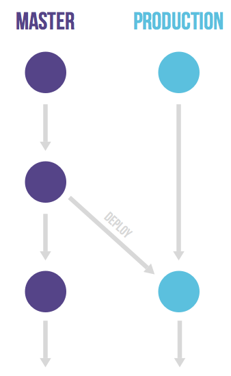

# 翻译对照
GitLab Flow：GitLab 流程
feature driven development：特征驱动开发
commit：提交
staging area：暂存区
master branch：主分支
continuous delivery：持续交付
ceremony：典礼
hotfix：补丁
rebase：衍合
inventory：清单
release：发布
issues：问题
production branch：生产分支
stable branch：稳定分支
staging environment：准生产环境
pre-production environment：预生产环境
production environment：生产环境
issue：问题
repository：仓库

# 引言 Introduction

使用 Git 进行版本管理使得分支与合并比其它的版本系统（比如 SVN）更加容易。
Version management with git makes branching and merging much easier than older versioning systems such as SVN.
这允许多种多样的分支策略与工作流程。
This allows a wide variety of branching strategies and workflows.
几乎所有这些都是 Git 之前使用方法的一种改进。
Almost all of these are an improvement over the methods used before git.
但是，许多组织以一个没有清晰定义的、极度复杂的或者没有与问题跟踪系统集成的工作流程而告终。
But many organizations end up with a workflow that is not clearly defined, overly complex or not integrated with issue tracking systems.
因此，我们计划把 GitLab 流程作为一套清晰定义的最佳实践。
Therefore we propose the GitLab flow as clearly defined set of best practices.
它结合[特征驱动开发](http://en.wikipedia.org/wiki/Feature-driven_development)、[特征分支](http://martinfowler.com/bliki/FeatureBranch.html)与问题跟踪。
It combines [feature driven development](http://en.wikipedia.org/wiki/Feature-driven_development) and [feature branches](http://martinfowler.com/bliki/FeatureBranch.html) with issue tracking.

从其它版本控制系统转到 Git 的组织经常发现很难开发出一个有效的工作流程。
Organizations coming to git from other version control systems frequently find it hard to develop an effective workflow.
这篇文章描述 GitLab 流程——结合 GitLab 流程与一个问题跟踪系统。
This article describes the GitLab flow that integrates the git workflow with an issue tracking system.
它提供一个使用 Git 工作的简单、易懂、有效的方法。
It offers a simple, transparent and effective way to work with git.

当转变到 Git，你必需习惯于这样的事实——在一个提交与同事共享之前有三个步骤。
When converting to git you have to get used to the fact that there are three steps before a commit is shared with colleagues.
许多版本控制系统只有一个步骤——从工作副本提交到共享服务器。
Most version control systems have only step, committing from the working copy to a shared server.

在 Git 中，你从工作副本中添加文件到暂存区。然后，你提交它们到本地仓库。
In git you add files from the working copy to the staging area. After that you commit them to the local repo.
第三个步骤是推送到一个共享的远程仓库。
The third step is pushing to a shared remote repository.
使用这三个步骤后，分支模型变成挑战。
After getting used to these three steps the branching model becomes the challenge.

由于许多刚开始使用 Git 的组织没有如何使用它工作的约定，很容易变成一团糟。
Since many organizations new to git have no conventions how to work with it, it can quickly become a mess.
它们遭遇的最大问题是：周围是每个包含一部分变更的许多个长久运作的分支。
The biggest problem they run into is that many long running branches that each contain part of the changes are around.
人们很难区分哪个分支是他们要开发的或者是部署到生产的。
People have a hard time figuring out which branch they should develop on or deploy to production.
经常反应这个问题的是采用如 [Git 流程](http://nvie.com/posts/a-successful-git-branching-model/)与 [GitHub 流程](http://scottchacon.com/2011/08/31/github-flow.html)的标准模式。
Frequently the reaction to this problem is to adopt a standardized pattern such as [git flow](http://nvie.com/posts/a-successful-git-branching-model/) and [GitHub flow](http://scottchacon.com/2011/08/31/github-flow.html)
我们认为仍有改进的余地，并详细介绍一套我们称为 GitLab 流程的实践。
We think there is still room for improvement and will detail a set of practices we call GitLab flow.

# Git 流程与它的问题 Git flow and its problems

[

Git 流程是使用 Git 分支的首批建议书中的一个，并且它已经受到很多的关注。
Git flow was one of the first proposals to use git branches and it has gotten a lot of attention.
它提倡一个主分支与一个单独的开发分支，以及特征、发布与补丁的许多次要分支。
It advocates a master branch and a separate develop branch as well as supporting branches for features, releases and hotfixes.
开发产生在开发分支上，移动到一个发布分支上，最后合并到主分支。
The development happens on the develop branch, moves to a release branch and is finally merged into the master branch.
Git 流程是一个明确定义的标准，但是它的复杂性引入两个问题。
Git flow is a well defined standard but its complexity introduces two problems.
第一个问题是：开发人员必需使用开发分支，而不是主分支，主分支预留给已发布到生产的代码。
The first problem is that developers must use the develop branch and not master, master is reserved for code that is released to production.
有个惯例：称呼你的默认分支为主分支，通常从这分支，并且合并到这。
It is a convention to call your default branch master and to mostly branch from and merge to this.
因此，大部分工具自动把主分支当做默认分支，并且默认显示这个分支，切换到别的分支是令人讨厌的。
Since most tools automatically make the master branch the default one and display that one by default it is annoying to have to switch to another one.
Git 流程的第二个问题时：引入补丁与发布分支的复杂性。
The second problem of git flow is the complexity introduced by the hotfix and release branches.
这些分支对某些组织来说是个好主意，但是对绝大多数来说是多样的。
These branches can be a good idea for some organizations but are overkill for the vast majority of them.
现在大部分组织实施持续交付，意味着你的默认分支可以部署。
Nowadays most organizations practice continuous delivery which means that your default branch can be deployed.
这意味着已修复的与发布分支可以避免包含所有它们引入的典礼。
This means that hotfixed and release branches can be prevented including all the ceremony they introduce.
一个这样典礼的例子：从发布分支合并回来。
An example of this ceremony is the merging back of release branches.
虽然确实有可以解决这个问题的特定工具，但是它们需要文档说明与增加复杂性。
Though specialized tools do exist to solve this, they require documentation and add complexity.
通常，开发人员会犯错误，例如：变更只合并到主分支而没有合并到开发分支。
Frequently developers make a mistake and for example changes are only merged into master and not into the develop branch.
出现这样错误的根源是对大多数情况下 Git 流程太复杂了。
The root cause of these errors is that git flow is too complex for most of the use cases.
并且发布没有意味着也自动完成补丁。
And doing releases doesn't automatically mean also doing hotfixes.

# GitHub 流程像一个更简单的替代品 GitHub flow as a simpler alternative

对比 Git 流程，详细说明一个更简单的替代品，[GitHub 流程](https://guides.github.com/introduction/flow/index.html)。
In reaction to git flow a simpler alternative was detailed, [GitHub Flow](https://guides.github.com/introduction/flow/index.html).
该流程只有特征分支与一个主分支。
This flow has only feature branches and a master branch.
这流程非常简单与清晰，许多组织已经采用它并取得很大的成功。
This is very simple and clean, many organizations have adopted it with great success.
Atlassian 推荐[一个相似的策略](http://blogs.atlassian.com/2014/01/simple-git-workflow-simple/)，虽然他们衍合特征分支。
Atlassian recommends [a similar strategy](http://blogs.atlassian.com/2014/01/simple-git-workflow-simple/) although they rebase feature branches.
合并所有东西到主分支并部署，经常意味着减少精益求精“清单”中的代码量与持续交付最佳实践。
Merging everything into the master branch and deploying often means you minimize the amount of code in 'inventory' which is in line with the lean and continuous delivery best practices.
但是，该流程仍留下很多关于部署、环境、发布与问题集成的问题未回答。
But this flow still leaves a lot of questions unanswered regarding deployments, environments, releases and integrations with issues.
通过 GitLab 流程，我们提供这些问题的额外指导。
With GitLab flow we offer additional guidance for these questions.

# GitLab 流程的生产分支 Production branch with GitLab flow

GitHub 流程确实假定每次你合并一个特征分支时你可以部署到生产。
GitHub flow does assume you are able to deploy to production every time you merge a feature branch.
这适合给软件即服务（Saas）的应用，但是这不适合很多种情况。
This is possible for SaaS applications but are many cases where this is not possible.
其中一种情况是当你没法控制确切的发布时刻，例如一个 iOS 应用需要通过应用商店的验证。
One would be a situation where you are not in control of the exact release moment, for example an iOS application that needs to pass AppStore validation.
另一个例子是你有部署窗口（运作团队全负荷工作、上午10点到下午4点的工作日），但是你也在其它时间内合并代码。
Another example is when you have deployment windows (workdays from 10am to 4pm when the operations team is at full capacity) but you also merge code at other times.
在这些情况下，你可以使得生产分支反映已部署的代码。
In these cases you can make a production branch that reflects the deployed code.
你可以部署一个合并到主分支的新版本到生产分支。
You can deploy a new version by merging in master to the production branch.
如果你需要知道哪些代码在生产中，你只需签出生产分支来看。
If you need to know what code is in production you can just checkout the production branch to see.
作为版本控制系统中的合并提交，近似的部署时间很容易看到。
The approximate time of deployment is easily visible as the merge commit in the version control system.
如果你自动部署你的生产分支，这个时间相当精确。
This time is pretty accurate if you automatically deploy your production branch.
如果你需要更精确的时间，你可以在每次部署时使用你的部署代码创建一个标签。
If you need a more exact time you can have your deployment script create a tag on each deployment.
这个流程避免过度的发布、打标签与合并—— Git 流程中通常使用。
This flow prevents the overhead of releasing, tagging and merging that is common to git flow.

# GitLab 流程的环境分支 Environment branches with GitLab flow

有个环境自动更新到主分支可能是个好主意。
It might be a good idea to have an environment that is automatically updated to the master branch.
只有在这种情况下，这个环境名可能与分支名不同。
Only in this case, the name of this environment might differ from the branch name.
假设你有一个准生产环境、一个预生产环境与一个生产环境。
Suppose you have a staging environment, a pre-production environment and a production environment.
在这种情况下，主分支部署在准生产环境。当有人想要部署到预生产环境，他们从主分支创建一个合并请求到预生产分支。
In this case the master branch is deployed on staging. When someone wants to deploy to pre-production they create a merge request from the master branch to the pre-production branch.
然后继续通过合并预生产分支到生产分支来代码生产。
And going live with code happens by merging the pre-production branch into the production branch.
这个提交只能向下流动的工作流程确保任何东西已在所有环境中测试。
This workflow where commits only flow downstream ensures that everything has been tested on all environments.
如果你需要择优筛选一个含补丁的提交，它通常在一个特征分支上开发，然后通过一个合并请求合并到主分支中，不删除特征分支。
If you need to cherry-pick a commit with a hotfix it is common to develop it on a feature branch and merge it into master with a merge request, do not delete the feature branch.
如果主分支准备好了（如果你是实践[持续交付](http://martinfowler.com/bliki/ContinuousDelivery.html)，它应该是好的），然后合并它到其它分支。
If master is good to go (it should be if you a practicing [continuous delivery](http://martinfowler.com/bliki/ContinuousDelivery.html)) you then merge it to the other branches.
如果是因为需要更多的手动测试而不可能，你可以从特征分支发送合并请求到下游分支。
If this is not possible because more manual testing is required you can send merge requests from the feature branch to the downstream branches.
一个环境分支的“极端”版本可以由 [Teatro](http://teatro.io/) 给每个特征分支设置一个环境。
An 'extreme' version of environment branches are setting up an environment for each feature branch as done by [Teatro](http://teatro.io/).

# GitLab 流程的发布分支 Release branches with GitLab flow

只有在你需要发布软件到外部世界的情况下，你才需要用发布分支来工作。
Only in case you need to release software to the outside world you need to work with release branches.
在这种情况下，每个分支包含一个次版本号（2-3-stable、2-4-stable、等等）。
In this case, each branch contains a minor version (2-3-stable, 2-4-stable, etc.).
稳定分支使用主分支作为起始点，并且尽可能晚地创建。
The stable branch uses master as a starting point and is created as late as possible.
通过尽可能晚地分支，你花费最少的时间来给多个分支应用错误修正。
By branching as late as possible you minimize the time you have to apply bugfixes to multiple branches.
一个发布分支宣布以后，只有严重的错误修正才会包含在发布分支中。
After a release branch is announced, only serious bug fixes are included in the release branch.
如果可能的话，这些错误修正先合并到主分支，再择优筛选它们到发布分支。
If possible these bug fixes are first merged into master and then cherry-picked into the release branch.
这样，你不会忘记择优筛选它们到主分支，也不会在随后的发布中遭遇同一的bug。
This way you can't forget to cherry-pick them into master and encounter the same bug on subsequent releases.
这称为一种“上游优先”的策略，同样也被 [Google](http://www.chromium.org/chromium-os/chromiumos-design-docs/upstream-first) and [Red Hat](http://www.redhat.com/about/news/archive/2013/5/a-community-for-using-openstack-with-red-hat-rdo) 实践。
This is called an 'upstream first' policy that is also practiced by [Google](http://www.chromium.org/chromium-os/chromiumos-design-docs/upstream-first) and [Red Hat](http://www.redhat.com/about/news/archive/2013/5/a-community-for-using-openstack-with-red-hat-rdo).
每次一个错误修正被包含到一个发布分支，通过设置一个标签来上升补丁版本号（遵从 [Semantic 版本命名](http://semver.org/)）。
Every time a bug-fix is included in a release branch the patch version is raised (to comply with [Semantic Versioning](http://semver.org/)) by setting a new tag.
一些项目也有一个指向同样提交的稳定分支作为最新发布分支。
Some projects also have a stable branch that points to the same commit as the latest released branch.
在这种流程中，通常不会有一个生产分支（或者 Git 流程的主分支）。
In this flow it is not common to have a production branch (or git flow master branch).

# GitLab 流程的合并/拉取请求 Merge/pull requests with GitLab flow

在 Git 管理应用中创建合并或者拉取请求，然后邀请一位指派的人合并两个分支。
Merge or pull requests are created in a git management application and ask an assigned person to merge two branches.
因第一个手动操作应当为拉取特征分支，诸如 GitHub 与 Bitbucket 的工具选择拉取作为名称。
Tools such as GitHub and Bitbucket choose the name pull request since the first manual action would be to pull the feature branch.
因合并为请求代理人的最后一个操作，诸如 GitLab 与 Gitorious 的工具选择合并请求作为名称。
Tools such as GitLab and Gitorious choose the name merge request since that is the final action that is requested of the assignee.
在本文中，我们将称它们为合并请求。
In this article we'll refer to them as merge requests.

如果你在一个特征分支上工作超过几个小时，最好跟团队的其他成员分享中间结果。
If you work on a feature branch for more than a few hours it is good to share the intermediate result with the rest of the team.
通过创建一个没有指派给任何人的合并请求来达成这个目标，而不是在描述或者评论中提到某人（/cc @mark @susan）。
This can be done by creating a merge request without assigning it to anyone, instead you mention people in the description or a comment (/cc @mark @susan).
这意味着它未准备好合并，但是反馈是欢迎的。
This means it is not ready to be merged but feedback is welcome.
你的团队成员可以在大体的合并请求上或者行注释的特定行上评论。
Your team members can comment on the merge request in general or on specific lines with line comments.
合并请求可以作为代码审查工具使用，而不需要诸如 Gerrit 与 reviewboard 的单独工具。
The merge requests serves as a code review tool and no separate tools such as Gerrit and reviewboard should be needed.
如果审查揭露缺点，任何人可以提交与推送一个修正。
If the review reveals shortcomings anyone can commit and push a fix.
通常干这个活的是创建合并/拉取请求的那个人。
Commonly the person to do this is the creator of the merge/pull request.
当一个新的提交被推送到该分支上，合并/拉取请求中的差异将自动更新。
The diff in the merge/pull requests automatically updates when new commits are pushed on the branch.

当你感觉它适合合并时，你指派它给一位最知道你已更改代码库的人，并且提到你想要反馈的其他人。
When you feel comfortable with it to be merged you assign it to the person that knows most about the codebase you are changing and mention any other people you would like feedback from.
那有更多的反馈空间，随后指派的那位觉得结果分支适合合并。
There is room for more feedback and after the assigned person feels comfortable with the result the branch is merged.
如果指派的人们觉得不合适，他们可以没有合并就关闭合并请求。
If the assigned person does not feel comfortable they can close the merge request without merging.

在 GitLab 中，通常保护生命周期长的分支（例如：主分支），因此，普通开发人员[不能修改这些已保护的分支](https://gitlab.com/gitlab-org/gitlab-ce/blob/master/doc/permissions/permissions.md)。
In GitLab it is common to protect the long-lived branches (e.g. the master branch) so that normal developers [can't modify these protected branches](https://gitlab.com/gitlab-org/gitlab-ce/blob/master/doc/permissions/permissions.md).
所以，如果你想合并它到一个已保护的分支，你指派它给 master 授权的某人。
So if you want to merge it into a protected branch you assign it to someone with master authorizations.

# GitLab 流程的问题跟踪 Issues with GitLab flow

GitLab 流程是一个使得代码与问题跟踪关联更透明的方法。
GitLab flow is a way to make the relation between the code and the issue tracker more transparent.

任何重大的代码变更应该以一个描述目的的问题开始。
Any significant change to the code should start with an issue where the goal is described.
对通知团队中每个成员与帮助人们保持特征分支的范围小，有每次代码变更的理由是重要的。
Having a reason for every code change is important to inform everyone on the team and to help people keep the scope of a feature branch small.
在 GitLab 中，每次代码库的变更从问题跟踪系统的一个问题开始。
In GitLab each change to the codebase starts with an issue in the issue tracking system.
假如有重大的工作（大于 1 个小时）将卷入，如果还没有问题，应该先创建它。
If there is no issue yet it should be created first provided there is significant work involved (more than 1 hour).
对于很多组织，因为问题必须将作为冲刺阶段的评估，自然这样做。
For many organizations this will be natural since the issue will have to be estimated for the sprint.
问题的标题应该描述系统的状态，例如，“作为管理员，我想没有收到错误地移除用户。”代替“管理员无法移除用户。”。
Issue titles should describe the desired state of the system, e.g. "As an administrator I want to remove users without receiving an error" instead of "Admin can't remove users.".

当你准备编写代码时，你从主分支开始一个问题的分支。
When you are ready to code you start a branch for the issue from the master branch.
分支名应该以问题编号开头，例如“15-require-a-password-to-change-it”。
The name of this branch should start with the issue number, for example '15-require-a-password-to-change-it'.

当你完成时或者想讨论代码时，你打开一个合并请求。
When you are done or want to discuss the code you open a merge request.
这是一个给讨论变变更与审查代码的在线地方。
This is an online place to discuss the change and review the code.
因为你并不总是想要合并你新推送的分支，创建一个分支是手动操作，它可能是一个长期的环境或者发布分支。
Creating a branch is a manual action since you do not always want to merge a new branch you push, it could be a long-running environment or release branch.
如果你创建一个合并请求但没有指派给任何人，它是一个“半成品”的合并请求。
If you create the merge request but do not assign it to anyone it is a 'work-in-process' merge request.
这被用来讨论提出的实现，但仍然没未准备好包含到主分支中。
These are used to discuss the proposed implementation but are not ready for inclusion in the master branch yet.

当作者认为代码准备好，将合并请求指派给审查员。
When the author thinks the code is ready the merge request is assigned to reviewer.
当审查员认为代码已准备好包含到主分支中，他们点击合并按钮。
The reviewer presses the merge button when they think the code is ready for inclusion in the master branch.
这种情况下代码已合并，并且将创建一个合并提交使得后来容易看到这个事件。
In this case the code is merged and a merge commit is generated that makes this event easily visible later on.
即使一个提交也没有增加， 合并请求总是创建一个合并提交。
Merge requests always create a merge commit even when the commit could be added without one.
在 Git 中这种合并策略称为“无快进（no fast-forward）”。
This merge strategy is called 'no fast-forward' in git.
然后，因已合并的特征分支不再需要，删除它，在 GitLab 中当合并时这个操作有个选项。
After the merge the feature branch is deleted since it is no longer needed, in GitLab this deletion is an option when merging.

假设一个分支已合并但是出现一个问题，然后重新打开该问题。
Suppose that a branch is merged but a problem occurs and the issue is reopened.
在这种情况下，重用相同的分支名没有问题，因为分支合并时它已删除。
In this case it is no problem to reuse the same branch name since it was deleted when the branch was merged.
任何时候，每个问题最多一个分支。
At any time there is at most one branch for every issue.
一个特征分支解决不止一个问题是可能的。
It is possible that one feature branch solves more than one issue.

# 从合并请求中链接与关闭问题  Linking and closing issues from merge requests

通过在提交消息或合并请求描述中提及他们（fixes #14、closes #67、等等），可以链接到问题。
Linking to the issue can happen by mentioning them from commit messages (fixes #14, closes #67, etc.) or from the merge request description.
在 GitLab 中，这将在问题中创建一条合并请求提交该问题的评论。
In GitLab this creates a comment in the issue that the merge requests mentions the issue.
并且合并请求显示已链接的问题。
And the merge request shows the linked issues.
当合并代码到默认分支时，这些问题将被关闭。
These issues are closed once code is merged into the default branch.

如果你只想创建一个引用而没有关闭问题，你也可以只提及它：“首选鸭子类型。#12”。
If you only want to make the reference without closing the issue you can also just mention it: "Ducktyping is preferred. #12".

如果你有一个问题跨越多个仓库，最好的办法是给每个仓库创建一个问题并且链接所有的问题到一个父问题。
If you have an issue that spans across multiple repositories, the best thing is to create an issue for each repository and link all issues to a parent issue.

# 使用衍合压缩提交 Squashing commits with rebase

使用 Git，你可以用一个交互式衍合（rebase -i）来压缩多个提交成一个提交，并重新排列他们。
With git you can use an interactive rebase (rebase -i) to squash multiple commits into one and reorder them.
如果你在开发中完成了两三个小更改的提交并且想替换它们为单个提交，或者你想让次序更合理，这个功能是有用的。
This functionality is useful if you made a couple of commits for small changes during development and want to replace them with a single commit or if you want to make the order more logical.
然而，你永远不应该衍合那些已推送到远端服务器的提交。
However you should never rebase commits you have pushed to a remote server.
有人可能已经引用那些提交，或者已经择优筛选它们。
Somebody can have referred to the commits or cherry-picked them.
当你衍合时你更改了提交的标识符（SHA1），这是混乱的。
When you rebase you change the identifier (SHA1) of the commit and this is confusing.
如果你那样做，同样的变更将被当作多个标识符，然后这会引起很大的混合。
If you do that the same change will be known under multiple identifiers and this can cause much confusion.
如果有人已经审查了你的代码，因你已经把所有的提交衍合为一个提交，他们将很难只审查你改进的地方。
If people already reviewed your code it will be hard for them to review only the improvements you made since then if you have rebased everything into one commit.

鼓励人们经常提交与频繁推送到远端仓库，所以，其他人了解每个人在做什么。
People are encouraged to commit often and to frequently push to the remote repository so other people are aware what everyone is working on.
这将导致每个变更有很多个提交，使得很难理解历史日志。
This will lead to many commits per change which makes the history harder to understand.
但是，有固定标识符的优点大于这个缺点。
But the advantages of having stable identifiers outweigh this drawback.
并且要理解内容中的一次变更，人们总是可以看合并提交——当合并代码到主分支时组织所有的提交到一起。
And to understand a change in context one can always look at the merge commit that groups all the commits together when the code is merged into the master branch.

你从特征分支合并多个提交到主分支后，这更难取消。
After you merge multiple commits from a feature branch into the master branch this is harder to undo.
如果你可能会压缩所有的提交到一个提交，你应该只恢复本次提交，但是，像我们指出你不应该在推送提交之后衍合它们。
If you would have squashed all the commits into one you could have just reverted this commit but as we indicated you should not rebase commits after they are pushed.
幸运地，[恢复一段时间以前的合并](http://git-scm.com/blog/2010/03/02/undoing-merges.html)可以由 Git 完成。
Fortunately [reverting a merge made some time ago](http://git-scm.com/blog/2010/03/02/undoing-merges.html) can be done with git.
但是，这需要有详细的合并提交给那些你想恢复的提交。
This however, requires having specific merge commits for the commits your want to revert.
如果你恢复一个合并然后你改变主意了，恢复那个恢复代替再次合并，因为另外 Git 不允许再次合并代码。
If you revert a merge and you change your mind, revert the revert instead of merging again since git will not allow you to merge the code again otherwise.

要能够恢复一个合并是个好理由在你手动合并时使用`--no-ff`选项创建一个合并提交。
Being able to revert a merge is a good reason always to create a merge commit when you merge manually with the `--no-ff` option.
在你接受一个合并请求时，Git 管理软件将总是创建一个合并提交。
Git management software will always create a merge commit when you accept a merge request.

# 不要使用衍合排列提交 Do not order commits with rebase

With git you can also rebase your feature branch commits to order them after the commits on the master branch.
This prevents creating a merge commit when merging master into your feature branch and creates a nice linear history.
However, just like with squashing you should never rebase commits you have pushed to a remote server.
This makes it impossible to rebase work in progress that you already shared with your team which is something we recommend.
When using rebase to keep your feature branch updated you [need to resolve similar conflicts again and again](http://blogs.atlassian.com/2013/10/git-team-workflows-merge-or-rebase/).
You can reuse recorded resolutions (rerere) sometimes, but with without rebasing you only have to solve the conflicts one time and you’re set.
There has to be a better way to avoid many merge commits.

The way to prevent creating many merge commits is to not frequently merge master into the feature branch.
We'll discuss the three reasons to merge in master: leveraging code, solving merge conflicts and long running branches.
If you need to leverage some code that was introduced in master after you created the feature branch you can sometimes solve this by just cherry-picking a commit.
If your feature branch has a merge conflict, creating a merge commit is a normal way of solving this.
You should aim to prevent merge conflicts where they are likely to occur.
One example is the CHANGELOG file where each significant change in the codebase is documented under a version header.
Instead of everyone adding their change at the bottom of the list for the current version it is better to randomly insert it in the current list for that version.
This it is likely that multiple feature branches that add to the CHANGELOG can be merged before a conflict occurs.
The last reason for creating merge commits is having long lived branches that you want to keep up to date with the latest state of the project.
Martin Fowler, in [his article about feature branches](http://martinfowler.com/bliki/FeatureBranch.html) talks about this Continuous Integration (CI).
At GitLab we are guilty of confusing CI with branch testing. Quoting Martin Fowler: "I've heard people say they are doing CI because they are running builds, perhaps using a CI server, on every branch with every commit.
That's continuous building, and a Good Thing, but there's no integration, so it's not CI.".
The solution to prevent many merge commits is to keep your feature branches shortlived, the vast majority should take less than one day of work.
If your feature branches commenly take more than a day of work, look into ways to create smaller units of work and/or use [feature toggles](http://martinfowler.com/bliki/FeatureToggle.html).
As for the long running branches that take more than one day there are two strategies.
In a CI strategy you can merge in master at the start of the day to prevent painful merges at a later time.
In a synchronization point strategy you only merge in from well defined points in time, for example a tagged release.
This strategy is [advocated by Linus Torvalds](https://www.mail-archive.com/dri-devel@lists.sourceforge.net/msg39091.html) because the state of the code at these points is better known.

In conclusion, we can say that you should try to prevent merge commits, but not eliminate them.
Your codebase should be clean but your history should represent what actually happened.
Developing software happen in small messy steps and it is OK to have your history reflect this.
You can use tools to view the network graphs of commits and understand the messy history that created your code.
If you rebase code the history is incorrect, and there is no way for tools to remedy this because they can't deal with changing commit identifiers.

# Voting on merge requests

It is common to voice approval or disapproval by using +1 or -1 emoticons.
In GitLab the +1 and -1 are aggregated and shown at the top of the merge request.
As a rule of thumb anything that doesn't have two times more +1's than -1's is suspect and should not be merged yet.

# Pushing and removing branches

We recommend that people push their feature branches frequently, even when they are not ready for review yet.
By doing this you prevent team members from accidentally starting to work on the same issue.
Of course this situation should already be prevented by assigning someone to the issue in the issue tracking software.
However sometimes one of the two parties forgets to assign someone in the issue tracking software.
After a branch is merged it should be removed from the source control software.
In GitLab and similar systems this is an option when merging.
This ensures that the branch overview in the repository management software shows only work in progress.
This also ensures that when someone reopens the issue a new branch with the same name can be used without problem.
When you reopen an issue you need to create a new merge request.

# Committing often and with the right message

We recommend to commit early and often.
Each time you have a functioning set of tests and code a commit can be made.
The advantage is that when an extension or refactor goes wrong it is easy to revert to a working version.
This is quite a change for programmers that used SVN before, they used to commit when their work was ready to share.
The trick is to use the merge/pull request with multiple commits when your work is ready to share.
The commit message should reflect your intention, not the contents of the commit.
The contents of the commit can be easily seen anyway, the question is why you did it.
An example of a good commit message is: "Combine templates to dry up the user views.".
Some words that are bad commit messages because they don't contain munch information are: change, improve and refactor.
The word fix or fixes is also a red flag, unless it comes after the commit sentence and references an issue number.
To see more information about the formatting of commit messages please see this great [blog post by Tim Pope](http://tbaggery.com/2008/04/19/a-note-about-git-commit-messages.html).

# Testing before merging

In old workflows the Continuous Integration (CI) server commonly ran tests on the master branch only.
Developers had to ensure their code did not break the master branch.
When using GitLab flow developers create their branches from this master branch so it is essential it is green.
Therefore each merge request must be tested before it is accepted.
CI software like Travis and GitLab CI show the build results right in the merge request itself to make this easy.
One drawback is that they are testing the feature branch itself and not the merged result.
What one can do to improve this is to test the merged result itself.
The problem is that the merge result changes every time something is merged into master.
Retesting on every commit to master is computationally expensive and means you are more frequently waiting for test results.
If there are no merge conflicts and the feature branches are short lived the risk is acceptable.
If there are merge conflicts you merge the master branch into the feature branch and the CI server will rerun the tests.
If you have long lived feature branches that last for more than a few days you should make your issues smaller.

# Merging in other code

When initiating a feature branch, always start with an up to date master to branch off from.
If you know beforehand that your work absolutely depends on another branch you can also branch from there.
If you need to merge in another branch after starting explain the reason in the merge commit.
If you have not pushed your commits to a shared location yet you can also rebase on master or another feature branch.
Do not merge in upstream if your code will work and merge cleanly without doing so, Linus even says that [you should never merge in upstream at random points, only at major releases](http://lwn.net/Articles/328438/).
Merging only when needed prevents creating merge commits in your feature branch that later end up littering the master history.

### References

- [Sketch file](https://www.dropbox.com/s/58dvsj5votbwrzv/git_flows.sketch?dl=0) with vectors of images in this article
- [Git Flow by Vincent Driessen](http://nvie.com/posts/a-successful-git-branching-model/)
